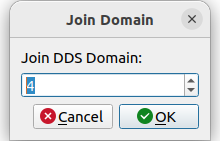
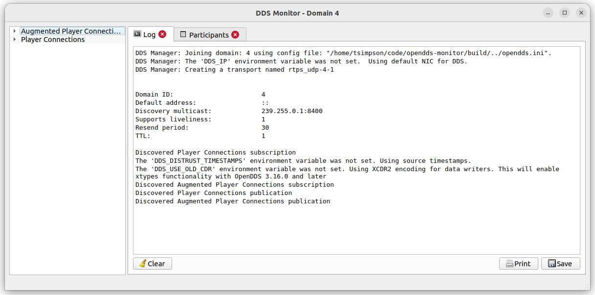
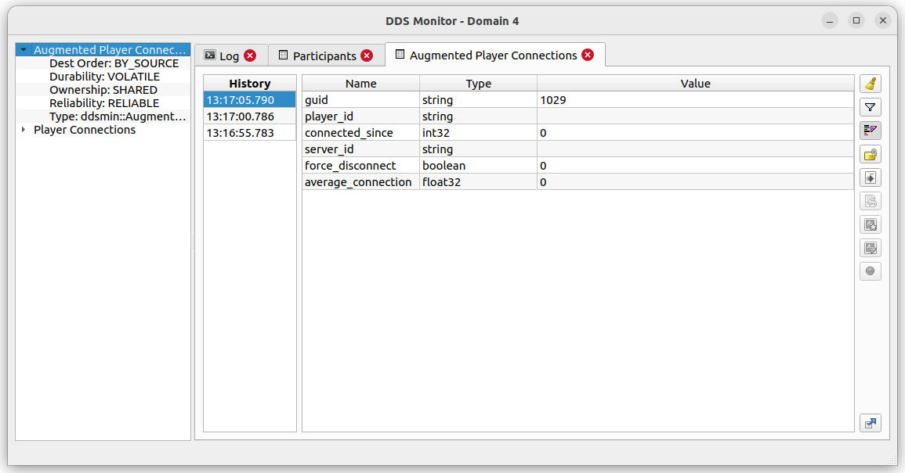

# OpenDDS Monitor

A Qt application for monitoring OpenDDS domain participants and topics.

## Requirements

* OpenDDS (http://www.opendds.org) and its dependencies (ACE/TAO, and possibly openssl or xerces3)
* Qt 5
* Qwt
* CMake
* A compiler and tool chain capable of C++17

## Tested Platforms

* Ubuntu 22.04 (g++ 11.2.0)
* Ubuntu 20.04 (g++ 9.4.0)
* macOS 12 (Apple clang XXX)
* macOS 11 (Apple clang 13.0.0)
* Windows Server 2022 (VS2022)
* Windows Server 2019 (VS2019)

## Building

Assuming a valid development environment, OpenDDS environment variables are set, and Qt / Qwt installs are discoverable:
```
$ mkdir bulid
$ cd build
$ cmake ..
$ cmake --build .
```
See `.github/workflows/build.yml` for explicit list of steps for building on several supported platforms listed above.

## Configuration

An OpenDDS configuration file named `opendds.ini` is expected in either the same directory as (or parent directory of)
the monitor executable for governing the local domain participant, otherwise the application will quietly exit after the
initial domain-chooser dialogue. Be sure to configure the local OpenDDS domain participant to for the domain you intend
to monitor, including matching any changes from OpenDDS interoperability defaults (e.g. multicast addresses) as those
applications being monitored. See the OpenDDS Developers Guide for (at opendds.org) for more details on configuration
options.

## Usage

Upon startup, users will be asked to choose a domain, which will remain constant during application execution. The local
domain participant will use the configuration provided in `opendds.ini` to monitor the chosen DDS domain.



The application then displays a dialog with a list of discovered DDS topics within the chosen domain. It also displays
an tab containing an application log and a tab containing information on discovered particiants.



When the application is capable of gathering sufficient type information for a DDS topic, users may click on topic names
within the left-hand table and a new tab will open which presents all samples read on the selected topic. Various
controls are enabled on these topic-specific tabs which allow for various filtering and view options, as well as
graphical plotting of specified fields, recording of samples, and even writing of modified sample data back onto the
topic, depending on qos.



